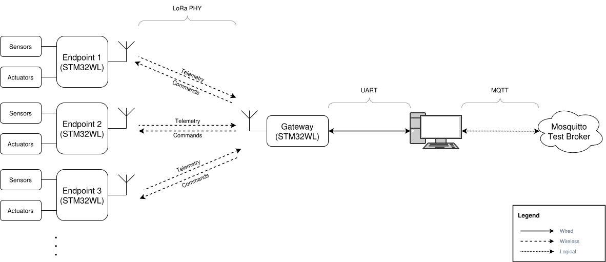
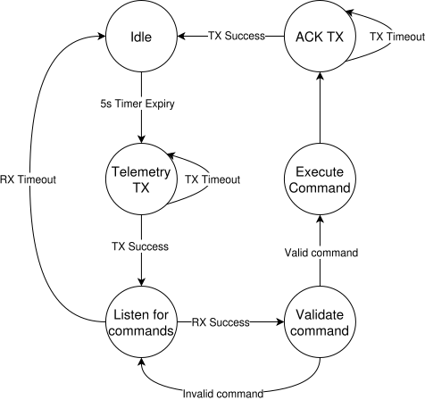
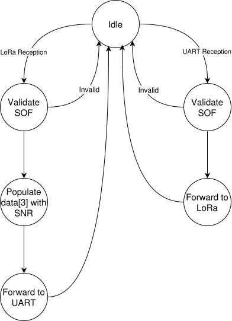

# LoRa-based Telemetry and Actuator Control Application

## Architecture

## Design
### Endpoint

Protocol stack:
- PHY: LoRa
- MAC: custom
- Application Layer: custom, "telemetry" and "command"

### Gateway

Protocol stack:
- PHY: LoRa (uplink RX/downlink TX), UART (uplink TX/downlink RX)
- MAC: custom
- Application Layer: custom, "telemetry" and "command"

### Python Bridge
Protocol stack:
- Uplink RX: UART PHY/custom MAC/custom pplication layer
- Uplink TX: MQTT/custom payload formats
- Downlink RX: MQTT/custom payload formats
- Downlink TX: UART PHY/custom MAC/custom pplication layer
